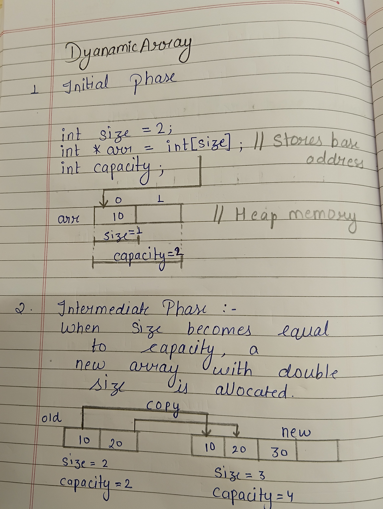

# Dynamic Array Design Proposal - version 2

## Overview 
A dynamically resizable array that stores elements in contiguous memory and provides efficient random access. 

# Section 1 - Public API

The APIs are designed to provide commonly used operations while keeping the implementation simple and modular.

```cpp
template<typename T> class DynamicArray{
    public:

    DynamicArray();// Constructor
    DynamicArray(const DynamicArray& other); //Copy Constructor
    DynamicArray(DynamicArray&& other); // Move Constructor
    ~DynamicArray(); //Destructor
    void push_back(T value); //Add value at last
    void insert(int index, T value); //Add value at given index
    void remove(int index);// Delete value by index
    void pop_back(); // Delete last element
    T get(int index);// return value at given index
    int size(); // return number of elements inserted
    int capacity();// returns total capacity of array
    void clear(); // remove all elements
};
```
**Templates** are used in all data structures to make them generic and reusable. They allow a single implementation to work with different data types without duplicating code, while also providing compile-time type safety and efficient performance.

# Section 2 - Internal Representation

## Rule of Three

All three data structures allocate memory dynamically. Therefore, each structure follows the Rule of Three by implementing a **destructor**, **copy constructor**, and **copy assignment operator**. These functions ensure proper resource management, prevent `memory leaks`, and provide correct deep copying of dynamically allocated data.


DynamicArray stores elements in a contiguous block of memory allocated on the *heap*. Two integer fields are maintained to track the current size and total capacity.

The destructor releases the dynamically allocated array using `delete[]`.

Copy operations perform a **deep copy** by allocating a new array and copying all elements from the source object.



### Copy Operations

All three data structures use **deep copying** for copy operations. During a copy operation, new memory is allocated and the contents of the source object are duplicated into the newly allocated memory.

Shallow copying is avoided because shared memory may lead to `dangling pointers`, `double deletion`, `undefined behavior`, and `program crashes`.

# Section 3 - Complexity Estimates

## DynamicArray

### push_back()

* **Best Case:** O(1)
* **Average Case:** O(1) amortized
* **Worst Case:** O(n)

**Why:** Appending normally places the element at the end of the array in constant time. When the array becomes full, a larger array is allocated and all existing elements are copied, resulting in O(n) time. Since resizing occurs infrequently, the average cost per insertion remains O(1).

### insert(index)

* **Best Case:** O(1)
* **Average Case:** O(n)
* **Worst Case:** O(n)

**Why:** Insertion at the end requires no shifting. Inserting elsewhere requires moving elements to the right.

### remove(index)

* **Best Case:** O(1)
* **Average Case:** O(n)
* **Worst Case:** O(n)

**Why:** Removing the last element is constant time. Otherwise, elements after the removed position must be shifted left.

### pop_back()

* **Best Case:** O(1)
* **Average Case:** O(1)
* **Worst Case:** O(1)

**Why:** The size counter is simply decreased by one.

### get(index)

* **Best Case:** O(1)
* **Average Case:** O(1)
* **Worst Case:** O(1)

**Why:** Array indexing directly computes the memory address.

### size()

* **Best Case:** O(1)
* **Average Case:** O(1)
* **Worst Case:** O(1)

**Why:** The size is maintained in a variable.

### capacity()

* **Best Case:** O(1)
* **Average Case:** O(1)
* **Worst Case:** O(1)

**Why:** The capacity is stored in a variable.

### clear()

* **Best Case:** O(n)
* **Average Case:** O(n)
* **Worst Case:** O(n)

**Why:** The entire array memory is released using a single delete[] operation.

---

## Section 4 - Design Decision

`Proposed design reason`  
2x Resize - It gives amortized O(1) for insertion

`Rejected design reason`  
Append single slot - Gives nearly O(N²) complexity
