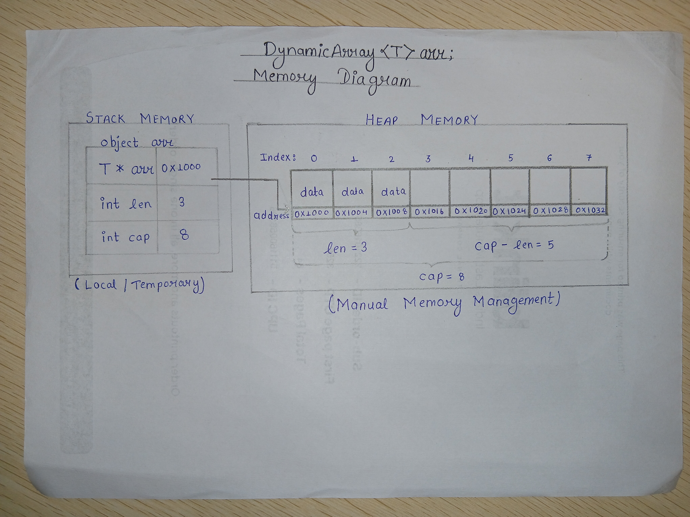

# Dynamic Array Design Proposal - version 3

## Overview 
A dynamically resizable array that stores elements in contiguous memory and provides efficient random access. 

# Section 1 - Public API

The APIs are designed to provide commonly used operations while keeping the implementation simple and modular.

```cpp
template<typename T> class DynamicArray{

    private:
    void resize();
    void destroyAndFree(T * arr,int count);
    
    public:
    int len;
    int cap;
    T * arr ;
    DynamicArray();// Constructor
    DynamicArray(int cap,T val);// Constructor with capacity and value
    DynamicArray(const DynamicArray& other); //Copy Constructor
    DynamicArray& operator=(const DynamicArray& other); //Copy Assignment Constructor
    T& operator [](int index); // operator [] with =
    bool operator==(const DynamicArray &others)const;
    const T& operator [](int index) const; // const operator []
    ~DynamicArray(); //Destructor
    void push_back(const T& value); //Add value at last
    void insert(int index, const T& value); //Add value at given index
    void remove(int index);// Delete value by index
    void pop_back(); // Delete last element
    int size() const; // return number of elements inserted
    int capacity()const;// returns total capacity of array
    void clear(); // remove all elements
};

```
**Templates** are used in all data structures to make them generic and reusable. They allow a single implementation to work with different data types without duplicating code, while also providing compile-time type safety and efficient performance.

# Section 2 - Internal Representation

DynamicArray stores elements in a contiguous block of memory allocated on the *heap*. Two integer fields are maintained to track the current size and total capacity.

The destructor releases the dynamically allocated array using `free()`.
If the data type is non primitive then we use `is_trivially_destructible<T>`, which returns true if the data type **T** has a destructor, which means it is non primitive, and we need to use a loop to reach every block and call the destructor for type **T**.


---

## Rule of Three

All three data structures allocate memory dynamically. Therefore, each structure follows the Rule of Three by implementing a **destructor**, **copy constructor**, and **copy assignment operator**. These functions ensure proper resource management, prevent `memory leaks`, and provide correct deep copying of dynamically allocated data.

## Memory Diagram



### Copy Operations

All three data structures use **deep copying** for copy operations. During a copy operation, new memory is allocated and the contents of the source object are duplicated into the newly allocated memory.

Shallow copying is avoided because shared memory may lead to `dangling pointers`, `double deletion`, `undefined behavior`, and `program crashes`.

# Section 3 - Complexity Estimates

## Time Complexity Analysis

| Operation                           | Best Case |    Average Case    | Worst Case | Reason                                                                                                            |
| ----------------------------------- | :-------: | :----------------: | :--------: | ----------------------------------------------------------------------------------------------------------------- |
| `DynamicArray()`                    |    O(1)   |        O(1)        |    O(1)    | Initializes the array with the default capacity and member variables.                                             |
| `DynamicArray(int cap, T val)`      |    O(n)   |        O(n)        |    O(n)    | Allocates memory and constructs `cap` elements with the given value.                                              |
| `DynamicArray(const DynamicArray&)` |    O(n)   |        O(n)        |    O(n)    | Allocates new memory and performs a deep copy of all elements.                                                    |
| `operator=()`                       |    O(n)   |        O(n)        |    O(n)    | Frees existing memory and deep copies all elements from the source array.                                         |
| `operator[]`                        |    O(1)   |        O(1)        |    O(1)    | Direct indexing provides constant-time access to elements.                                                        |
| `operator==()`                      |    O(1)   |        O(n)        |    O(n)    | Arrays are compared element by element. If they differ early, the comparison terminates immediately.              |
| `push_back()`                       |    O(1)   | O(1) *(Amortized)* |    O(n)    | Normally inserts at the end. When the array is full, resizing requires copying all existing elements.             |
| `insert(int index)`                 |    O(1)   |        O(n)        |    O(n)    | Inserting at the end requires no shifting. Otherwise, elements are shifted to the right. Resizing may also occur. |
| `remove(int index)`                 |    O(1)   |        O(n)        |    O(n)    | Removing the last element is constant time. Otherwise, elements are shifted to fill the gap.                      |
| `pop_back()`                        |    O(1)   |        O(1)        |    O(1)    | Removes the last element by decreasing the size (and destroying the last object if required).                     |
| `size()`                            |    O(1)   |        O(1)        |    O(1)    | The current size is maintained in the `len` member variable.                                                      |
| `capacity()`                        |    O(1)   |        O(1)        |    O(1)    | The total capacity is maintained in the `cap` member variable.                                                    |
| `clear()`                           |    O(n)   |        O(n)        |    O(n)    | Every constructed element is destroyed before the array is reset.                                                 |
| `resize()` *(private)*              |    O(n)   |        O(n)        |    O(n)    | Allocates a larger array and copies all existing elements to the new memory block.                                |
| `destroyAndFree()` *(private)*      |    O(n)   |        O(n)        |    O(n)    | Destroys each constructed element (if necessary) and releases the allocated memory.                               |


## What is Amortised O(1) complexity:
### Meaning : spread out, paid off, or written off gradually over a specific period of time. 
Let n be the number of insertions.

Each insertion has a base cost of 1.

Whenever the array becomes full, its capacity is doubled. During resizing, all existing elements are copied.

The total number of copied elements after n insertions is:

1 + 2 + 4 + 8 + ... + n/2

This is a geometric series whose sum is:

< n

Therefore,

Total Cost
= n (insertions)
+ n (copies)
< 2n

Hence,

Amortized Cost
= Total Cost / n
< 2n / n
= 2
= O(1)

Therefore, the amortized complexity of push_back() is O(1).


## Section 4 - Design Decision

The `DynamicArray` was designed to provide a generic and efficient container similar to `std::vector` while understanding its internal implementation.


* Used **templates** to support any data type and improve reusability.
* Stored elements in **contiguous memory** for constant-time random access and better cache performance.
* Maintained separate **size** and **capacity** to avoid frequent memory allocations.
* Used **capacity doubling** during resizing to achieve **amortized O(1)** insertion.
* Managed memory manually using **placement new** and explicit destructors instead of **new** keyword to understand object lifetime management.
* Implemented **deep copy semantics** to prevent shared memory issues.
* Added operator overloading (`[]`, `==`) to provide an STL-like interface and improve usability.
