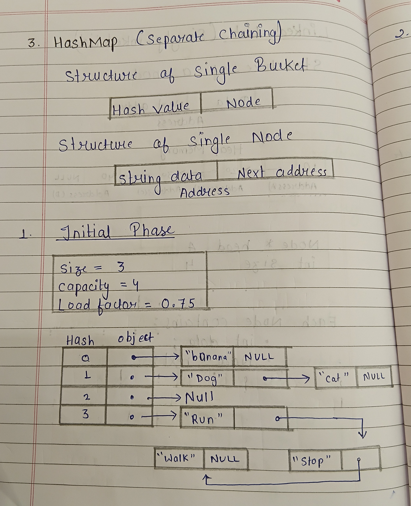
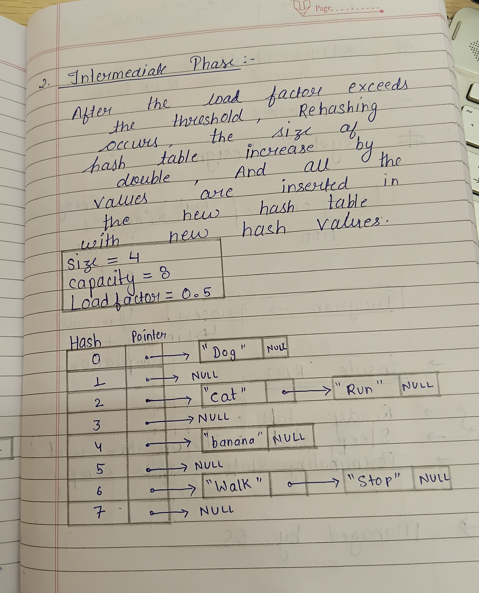

# HashMap Design Proposal - version 2

## Overview:
A key-value data structure that uses hashing to provide efficient average-case insertion, deletion, and lookup operations.

# Section 1 - Public API

The APIs are designed to provide commonly used operations while keeping the implementation simple and modular.

## HashMap

```cpp
template<typename K, typename V>
class HashMap {

private:
    struct Pair {
        K key;
        V value;
        Pair(K k, V v);
        bool operator==(const Pair& other) const {
            return key == other.key;
        }
    };
    DynamicArray<LinkedList<Pair>> buckets;
    int bucketCount;
    int elementCount;
    size_t hash(const K& key) const;
    void rehash();
public:
    HashMap(int capacity = 16);
    void insert(const K& key, const V& value);
    bool remove(const K& key);
    bool exists(const K& key) const;
    V& get(const K& key);
    int size() const;
    int capacity() const;
    float loadFactor() const;
    void clear();
};
```
**Templates** are used in all data structures to make them generic and reusable. They allow a single implementation to work with different data types without duplicating code, while also providing compile-time type safety and efficient performance.

# Section 2 - Internal Representation

## Rule of Three

All three data structures allocate memory dynamically. Therefore, each structure follows the Rule of Three by implementing a **destructor**, **copy constructor**, and **copy assignment operator**. These functions ensure proper resource management, prevent `memory leaks`, and provide correct deep copying of dynamically allocated data.

HashMap uses **separate chaining**. A bucket array stores pointers to *linked lists*, where each node in a chain stores a key and a value of type `T`.

The destructor `traverses` every bucket, deletes all nodes in the chains, and finally releases the bucket array.

Copy operations perform a deep copy by allocating a new bucket array and duplicating all key-value pairs.






### Copy Operations

All three data structures use **deep copying** for copy operations. During a copy operation, new memory is allocated and the contents of the source object are duplicated into the newly allocated memory.

Shallow copying is avoided because shared memory may lead to `dangling pointers`, `double deletion`, `undefined behavior`, and `program crashes`.


# Section 3 - Complexity Estimates

## HashMap

(Collision handling uses separate chaining.)

### insert()

* **Best Case:** O(1)
* **Average Case:** O(1)
* **Worst Case:** O(n)

**Why:** Under normal conditions, insertion occurs in a short chain. If all keys hash to the same bucket, the entire chain must be traversed.

### get()

* **Best Case:** O(1)
* **Average Case:** O(1)
* **Worst Case:** O(n)

**Why:** Hashing provides direct access to the appropriate bucket. In the worst case, all keys may collide into the same bucket, requiring traversal of the entire chain.

### exists()

* **Best Case:** O(1)
* **Average Case:** O(1)
* **Worst Case:** O(n)

**Why:** Searching is limited to a single chain in average cases, but may require scanning all elements if collisions are excessive.

### remove()

* **Best Case:** O(1)
* **Average Case:** O(1)
* **Worst Case:** O(n)

**Why:** The appropriate bucket is found directly, but collisions may require traversing a long chain.

### size()

* **Best Case:** O(1)
* **Average Case:** O(1)
* **Worst Case:** O(1)

**Why:** The number of stored elements is maintained in a variable.

### capacity()

* **Best Case:** O(1)
* **Average Case:** O(1)
* **Worst Case:** O(1)

**Why:** The number of buckets is stored in a variable.

### loadFactor()

* **Best Case:** O(1)
* **Average Case:** O(1)
* **Worst Case:** O(1)

**Why:** It is computed using size divided by capacity.

### clear()

* **Best Case:** O(n)
* **Average Case:** O(n)
* **Worst Case:** O(n)

**Why:** Every element stored in the hash table must be deleted. This requires traversing all chains and deleting each node once.


## Section 4 - Design Decision
`Proposed design reason`    
Using separate chaining for collision resolution - Easy insertion and deletion
Rehashing after reaching load factor 75% (0.75).

`Rejected design reason`  
Rejected linear probing because primary clustering increases the number of probes and degrades performance.
