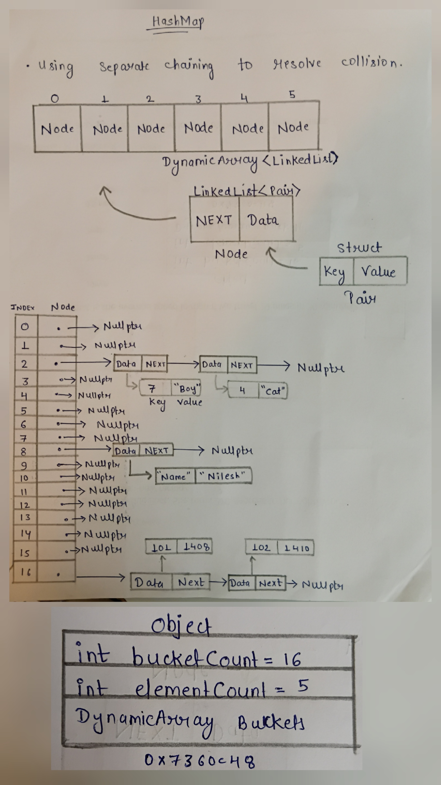

# HashMap Design Proposal - version 3


## Overview:
A key-value data structure that uses hashing to provide efficient average-case insertion, deletion, and lookup operations.

# Section 1 - Public API

The APIs are designed to provide commonly used operations while keeping the implementation simple and modular.

## HashMap

```cpp
template<typename K, typename V>
class HashMap {

private:
    struct Pair {
        K key;
        V value;
        Pair(K k, V v);
        bool operator==(const Pair& other) const {
            return key == other.key;
        }
    };
    DynamicArray<LinkedList<Pair>> buckets;
    int bucketCount;
    int elementCount;
    size_t hash(const K& key) const;
    void rehash();
public:
    HashMap(int capacity = 16);
    void insert(const K& key, const V& value);
    bool remove(const K& key);
    bool exists(const K& key) const;
    V& get(const K& key);
    int size() const;
    int capacity() const;
    float loadFactor() const;
    void clear();
};
```
**Templates** are used in all data structures to make them generic and reusable. They allow a single implementation to work with different data types without duplicating code, while also providing compile-time type safety and efficient performance.

# Section 2 - Internal Representation


HashMap uses **separate chaining** to handle collisions. The bucket array stores `LinkedList<Pair>` objects, where each node contains a key-value pair.

Memory management is handled automatically through the destructors of `DynamicArray` and `LinkedList`. When a `HashMap` object is destroyed, each bucket is cleaned up by its corresponding `LinkedList` destructor, which deletes all nodes in the chain.

## Rule of Three

All three data structures allocate memory dynamically. Therefore, each structure follows the Rule of Three by implementing a **destructor**, **copy constructor**, and **copy assignment operator**. These functions ensure proper resource management, prevent `memory leaks`, and provide correct deep copying of dynamically allocated data.

## Memory Diagram



### Copy Operations

All three data structures use **deep copying** for copy operations. During a copy operation, new memory is allocated and the contents of the source object are duplicated into the newly allocated memory.

Shallow copying is avoided because shared memory may lead to `dangling pointers`, `double deletion`, `undefined behavior`, and `program crashes`.


# Section 3 - Complexity Estimates

| Operation               | Best Case | Average Case | Worst Case | Reason                                                                                                                                                            |
| ----------------------- | :-------: | :----------: | :--------: | ----------------------------------------------------------------------------------------------------------------------------------------------------------------- |
| `HashMap(int capacity)` |    O(n)   |     O(n)     |    O(n)    | Initializes the bucket array by creating the specified number of empty linked lists.                                                                              |
| `hash(const K& key)`    |    O(1)   |     O(1)     |    O(1)    | Computes the bucket index using the hash function and modulo operation.                                                                                           |
| `insert()`              |    O(1)   |     O(1)     |    O(n)    | Under normal conditions, insertion occurs in a short chain. In the worst case, excessive collisions or rehashing may require traversing and reinserting elements. |
| `remove()`              |    O(1)   |     O(1)     |    O(n)    | The target bucket is located directly using hashing. In the worst case, the entire chain must be traversed.                                                       |
| `exists()`              |    O(1)   |     O(1)     |    O(n)    | Hashing limits the search to a single bucket. Excessive collisions may require scanning the complete chain.                                                       |
| `get()`                 |    O(1)   |     O(1)     |    O(n)    | The appropriate bucket is found directly. In the worst case, all keys collide into the same bucket.                                                               |
| `size()`                |    O(1)   |     O(1)     |    O(1)    | The number of stored elements is maintained in a member variable.                                                                                                 |
| `capacity()`            |    O(1)   |     O(1)     |    O(1)    | The bucket count is maintained in a member variable.                                                                                                              |
| `loadFactor()`          |    O(1)   |     O(1)     |    O(1)    | Computed using `elementCount / bucketCount`.                                                                                                                      |
| `clear()`               |    O(n)   |     O(n)     |    O(n)    | Every bucket is cleared by deleting all nodes stored in its linked list.                                                                                          |
| `rehash()`              |    O(n)   |     O(n)     |    O(n)    | A new bucket array is created and every existing key-value pair is rehashed and inserted into the new buckets.                                                    |


## Section 4 - Design Decision
`Proposed design reason`    
Using separate chaining for collision resolution - Easy insertion and deletion
Rehashing after reaching load factor 75% (0.75).

`Rejected design reason`  
Rejected linear probing because primary clustering increases the number of probes and degrades performance.
