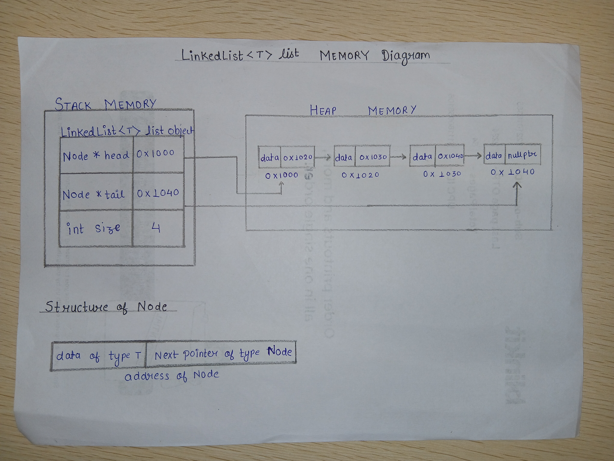

# Dynamic Array Design Proposal - version 3

## Overview 
A singly linked list consisting of nodes connected through pointers, allowing efficient insertion and deletion operations.

# Section 1 - Public API


```cpp   
template<typename T>class LinkedList{

    template<typename>
    friend struct MyHash;

    template<typename,typename>
    friend class HashMap;
    private:
    struct Node{
        T data;
        Node*next;
        Node(T val);
    };    
    public:
    Node*head=nullptr;
    Node*tail=nullptr;
    int size;
    LinkedList(); //Constructor
    ~LinkedList(); // Destructor
    LinkedList(const LinkedList& other); // Copy Constructor
    LinkedList& operator=(const LinkedList& other); // Handling assignment operator
    bool operator==(const LinkedList<T>& other) const;
    void insertHead(T value); //Insert value at front
    void remove(T val); // Delete value
    void insert(int pos, T value); //Insert value at given position
    void append(T value); // Add element at last
    void pop();// Delete last element
    void reverse(); // Reverse the LinkedList
    bool exists(T value); //returns true of value exists otherwise returns false 
    int length(); //return size of the linkedlist
    void clear();// Delete all elements

};
```

The current implementation uses a **singly linked list** because it provides a simple structure and satisfies the requirements of the project. However, the design remains *flexible*. If future requirements demand more efficient *bidirectional traversal* or *frequent operations* at both ends of the list, the implementation may be extended to a **doubly linked** list. Such a change can be made without affecting the public interface significantly, allowing the data structure to evolve based on performance considerations and project needs.

# Section 2 - Internal Representation
LinkedList consists of individually allocated nodes connected by *next pointers*. Each node stores a value of type `T` and a pointer to the next node.

The destructor `traverses` the list and deletes every node until the list becomes empty.

## Rule of Three

All three data structures allocate memory dynamically. Therefore, each structure follows the Rule of Three by implementing a **destructor**, **copy constructor**, and **copy assignment operator**. These functions ensure proper resource management, prevent `memory leaks`, and provide correct deep copying of dynamically allocated data.

## Memory Diagram


### Copy Operations

All three data structures use **deep copying** for copy operations. During a copy operation, new memory is allocated and the contents of the source object are duplicated into the newly allocated memory.

Shallow copying is avoided because shared memory may lead to `dangling pointers`, `double deletion`, `undefined behavior`, and `program crashes`.

# Section 3 - Complexity Estimates
## Time Complexity Analysis

| Operation                       | Best Case | Average Case | Worst Case | Reason                                                                                                             |
| ------------------------------- | :-------: | :----------: | :--------: | ------------------------------------------------------------------------------------------------------------------ |
| `LinkedList()`                  |    O(1)   |     O(1)     |    O(1)    | Initializes `head`, `tail`, and `size`.                                                                            |
| `~LinkedList()`                 |    O(n)   |     O(n)     |    O(n)    | Every node must be deleted to free the allocated memory.                                                           |
| `LinkedList(const LinkedList&)` |    O(n)   |     O(n)     |    O(n)    | A deep copy is performed by allocating new nodes and copying every element.                                        |
| `operator=()`                   |    O(n)   |     O(n)     |    O(n)    | Existing nodes are cleared and all elements are deep copied from the source list.                                  |
| `operator==()`                  |    O(1)   |     O(n)     |    O(n)    | Lists are compared node by node. If they differ early, the comparison terminates immediately.                      |
| `insertHead()`                  |    O(1)   |     O(1)     |    O(1)    | A new node is inserted by updating the head pointer.                                                               |
| `remove()`                      |    O(1)   |     O(n)     |    O(n)    | Removing the head node is constant time. Otherwise, traversal is required to locate the element.                   |
| `insert(int pos)`               |    O(1)   |     O(n)     |    O(n)    | Insertion at the beginning or end is constant time. Otherwise, traversal is required to reach the target position. |
| `append()`                      |    O(1)   |     O(1)     |    O(1)    | The tail pointer allows direct insertion at the end.                                                               |
| `pop()`                         |    O(n)   |     O(n)     |    O(n)    | In a singly linked list, traversal is required to find the node before the tail.                                   |
| `reverse()`                     |    O(n)   |     O(n)     |    O(n)    | Every node is visited once to reverse the links.                                                                   |
| `exists()`                      |    O(1)   |     O(n)     |    O(n)    | The value may be found immediately or after traversing the entire list.                                            |
| `length()`                      |    O(1)   |     O(1)     |    O(1)    | The number of nodes is maintained in the `size` member variable.                                                   |
| `clear()`                       |    O(n)   |     O(n)     |    O(n)    | Every node is deleted exactly once to release allocated memory.                                                    |
                                                    |

# Section 4 - Design Decision

* Used a **template-based implementation** to support any data type while keeping the linked list generic and reusable.
* Chose a **singly linked list** because it provides a simple structure with efficient insertion and deletion at the beginning while meeting the project's requirements.
* Maintained both **head** and **tail** pointers to achieve **O(1)** insertion at both the front and the end of the list.
* Stored the **size** as a member variable to provide **O(1)** time complexity for `length()` instead of traversing the entire list.
* Implemented the **Rule of Three** (destructor, copy constructor, and copy assignment operator) to ensure proper memory management and deep copy semantics.
* Used **deep copying** to avoid shared ownership of nodes, preventing dangling pointers, double deletion, and undefined behavior.
* Added operator overloading (`operator==`) to simplify list comparison and provide an STL-like interface.
* Designed the implementation to be **extensible**, allowing the underlying structure to be upgraded to a doubly linked list in the future without significantly changing the public API.
